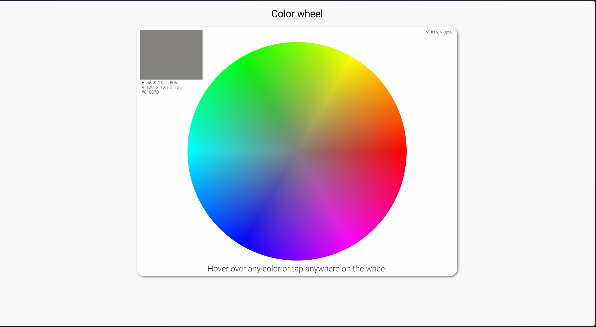

# Inspiration 
https://github.com/jbrems/color-wheel

# Color Wheel Project

This project is a color wheel application built with React and Vite. It allows users to interact with a color wheel, view color details, and copy color information.

## Demo


## Features

- Interactive color wheel
- Displays color details (HSL, RGB, Hex)
- Modal popup with color information
- Responsive design

## Technologies Used

- React
- Vite
- JavaScript
- CSS

## Getting Started

### Prerequisites

- Node.js (version 14 or higher)
- npm (version 6 or higher)

### Installation

1. Clone the repository:
   ```sh
   git clone https://github.com/Prarambha369/ColorWheel.git
   ```
2. Navigate to the project directory:
   ```sh/ 
    cd color-wheel
    ```
3. Install dependencies:
    ```sh
    npm install
    ```
4. Start the development server:
    ```sh
    npm run dev
    ```
5. Open the application in your browser:
    ```
    http://localhost:[value given in the terminal]
    ```
## Project Structure
``` 
/src
  /App.jsx
  /index.jsx
  /script.js
  /style.css
```

## Acknowledgements

- [React](https://reactjs.org/)
- [Vite](https://vitejs.dev/)
- [Modal](https://reactcommunity.org/react-modal/)

