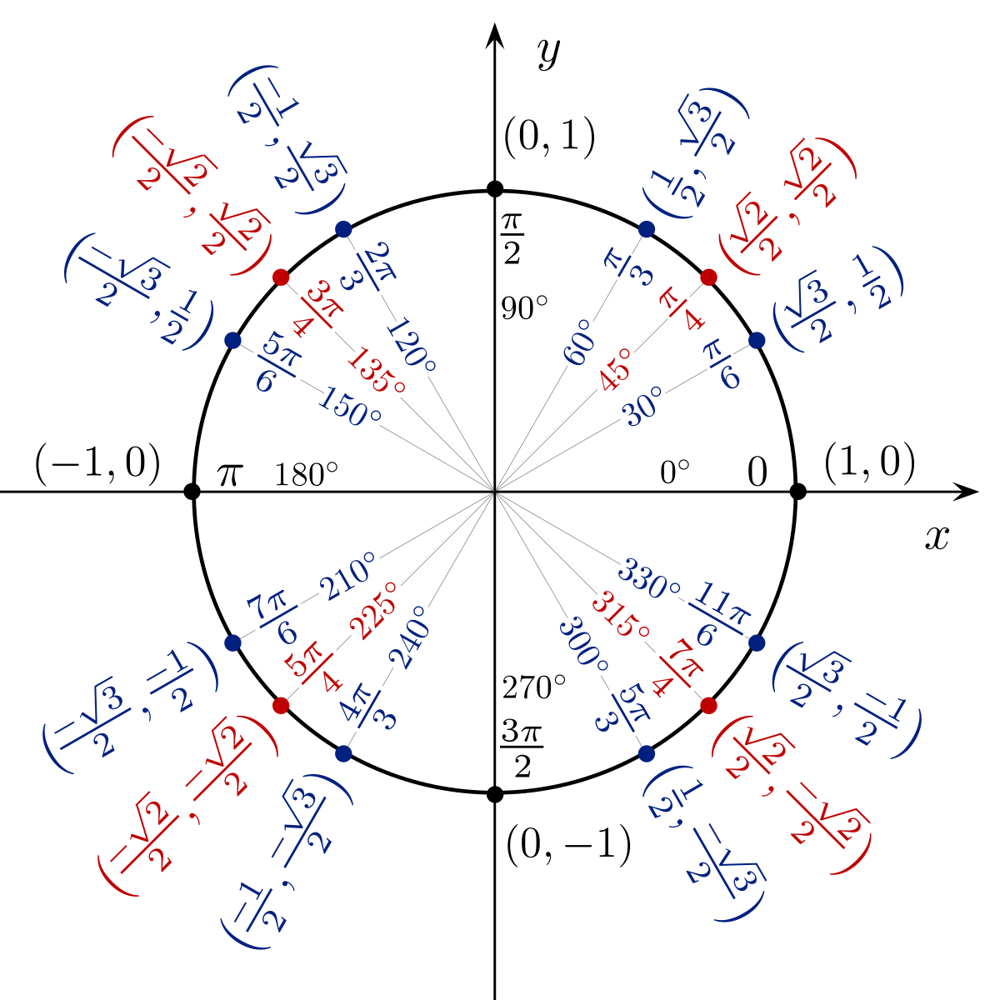
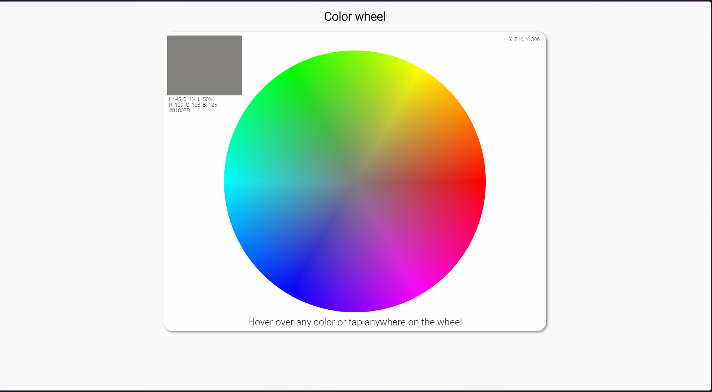

## Explanation
### 36 000 dots
The color wheel is drawn with 36 000 dots in different colors arranged in a circle. Each 1° segment of the wheel represents a single hue and the saturation of the color increases with the distance from the center of the circle. Since there are 360 degrees in a circle (corresponding with 360 hues) and since the saturation is expressed in percentages of which there are 100 we get 360 * 100 = 36 000 dots while working with integers.

### The color wheel
To draw these 36 000 dots in a circle pattern we make use of the sine function to determine the y value, and the cosine function to determine the x value. In JavaScript, the `Math.sin` and `Math.cos` functions expect the angle in radians, so we need to do a quick conversion from degrees to radians. A full circle is 360 degrees or 2π radians.

We use the saturation as the radius of our circle for each iteration (0 - 100).

The color wheel consists of 100 circles with varying radius based on the saturation. If we draw every 5th saturation circle, the wheel would look like this.

Another way we can define the color wheel is by 360 1° segments with a different color. The angle (0 - 360) defines the hue (0 - 360) of the color. If we draw every 5th hue segment, the wheel would look like this.

The first color in the hue scale (value 0) is red and lies directly to the right of the center of the wheel. This makes sense since we generally measure angles relative to the positive x axis.

### The color picker
When you hover over (or tap) a color in the color wheel its information is displayed in the top left corner of the canvas. To achieve this, we need to determine the color based on the relative x and y values of the cursor.
#### Saturation
Determining the saturation of the color based on the x and y values is quite straightforward. We just need to calculate the distance of that point to the center of the wheel which is conveniently positioned at the center of the canvas. To calculate the distance between 2 points on a 2D plane we use the Pythagorean theorem a² + b² = c² where a is the absolute difference in x values of the point and the center, b is the absolute difference in y values and the resulting c is the distance from the center of the wheel.

#### Hue
To determine the hue of the color based on the x value of the cursor we need to inverse the cosine function we used to calculate the position of the dot in the color wheel. If we want to base ourselves on the y value we have to inverse the sine function. In this case we use the x value, and we quickly notice that there are always 2 colors for every given x value and distance from the center of the wheel. To get around this issue, we add a check to determine whether the cursor is above or below the vertical middle (y) of the wheel, and we inverse the hue value of the color when the cursor is below.

If we base ourselves on the y value to determine the hue we will find 2 colors for every given y value and distance from the center, and we need to adapt the hue value based on the position of the cursor to the left or right of the horizontal middle (x) of the wheel.

### Color notations
For converting the colors in HSL (hue, saturation, lightness) notation to RGB (red, green, blue) we use the formula as explained at [RapidTables](https://www.rapidtables.com/convert/color/hsl-to-rgb.html). To convert the RGB value to the hexadecimal notation we just need to convert the base 10 integers (0 - 255) representing the red, green, and blue values to their hexadecimal equivalent.

# Color Wheel Project

This project is a color wheel application built with **React** and **Vite**. It allows users to interact with a color wheel, view color details, and copy color information.

## Demo (OLD)

## Demo (NEW)


## Features

- **Interactive color wheel**: Users can hover or click on the wheel to select colors.
- **Displays color details**: Shows HSL, RGB, and Hex values of the selected color.
- **Modal popup with color information**: Displays detailed information about the selected color.
- **Responsive design**: Works seamlessly across devices and screen sizes.

## Technologies Used

- React
- Vite
- JavaScript
- CSS

## Getting Started

### Prerequisites

- Node.js (version 14 or higher)
- npm (version 6 or higher)

### Installation

1. Clone the repository:
   ```sh
   git clone https://github.com/Prarambha369/ColorWheel.git
    ```
   
2. Navigate to the project directory:
   ```sh/ 
    cd color-wheel
    ```
3. Install dependencies:
    ```sh
    npm install
    ```
4. Start the development server:
    ```sh
    npm run dev
    ```
5. Open the application in your browser:
    ```
    http://localhost:[value given in the terminal]
    ```


## Acknowledgements

- [React](https://reactjs.org/)
- [Vite](https://vitejs.dev/)
- [Modal](https://reactcommunity.org/react-modal/)
- [Inspiration](https://github.com/jbrems/color-wheel)

